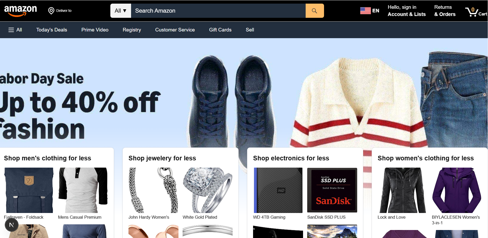

#  Amazon Clone (Work in Progress)

A full-stack e-commerce web app inspired by **Amazon**, built from scratch with **Next.js, TypeScript, and Supabase**.  
This project demonstrates authentication, product listings, cart management, and checkout flow — with a clean, responsive UI.

---
 
## Features (so far)

- User authentication (Supabase)  
- Product listing with categories  
- Shopping cart with total price calculation  
- Checkout flow (basic version)  
- Responsive design with modern UI  

---

##  Tech Stack

- [Next.js](https://nextjs.org/) – React framework  
- [TypeScript](https://www.typescriptlang.org/) – Type safety  
- [Supabase](https://supabase.com/) – Auth + Database  
- [Tailwind CSS](https://tailwindcss.com/) – Styling  
- [Netlify / Vercel](https://vercel.com/) – Deployment  

---


---

**Live Demo**: [amazon-clone-nnzm.vercel.app](https://amazon-clone-nnzm.vercel.app)
## Contact

Feel free to reach out if you have questions or want to connect:

- [LinkedIn](https://www.linkedin.com/in/abdennour-darkaoui-2b2873356/)
- [WhatsApp](https://wa.me/212708132603)
- [abdobaouch996@gmail.com](mailto:abdobaouch996@gmail.com)

## Preview



##  Installation & Setup

```bash
# Clone this repo
git clone https://github.com/7abd/amazon___clone.git

# Go into the project___
cd amazon___clone

# Install dependencies
npm install

# Run the development server
npm run dev


