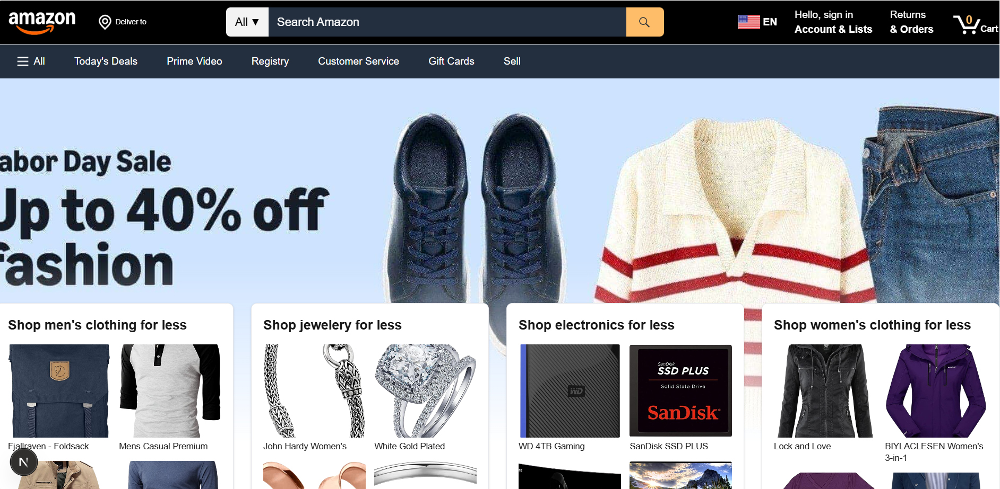

#  Amazon Clone 

A full-stack e-commerce web application inspired by **Amazon**, built from scratch with **Next.js, TypeScript, and Supabase**.  
This project demonstrates user authentication, product listings, shopping cart management, and secure checkout flow with Stripe payment integration — all with a clean, responsive UI.

---

##  Features

- **User Authentication** – Sign-up and login with Supabase Auth
- **Product Listing** – Browse products with category filtering
- **Product Search & Filtering** – Find products by category
- **Shopping Cart** – Add/remove items, real-time price calculation
- **Checkout Flow** – Multi-step checkout process
- **Stripe Payment Integration** – Secure payment processing
- **Payment Success Confirmation** – Order confirmation page
- **Responsive Design** – Mobile-friendly UI with modern styling
- **Product Details** – Individual product pages with ratings
- **Category Grid** – Visual category navigation

---

##  Tech Stack

### Frontend
- **[Next.js](https://nextjs.org/) v16** – React framework with Server-Side Rendering
- **[React](https://react.dev/) 19.1.0** – UI library
- **[React DOM](https://react.dev/reference/react-dom) 19.1.0** – React rendering
- **[TypeScript](https://www.typescriptlang.org/)** – Static type safety
- **[Tailwind CSS](https://tailwindcss.com/)** – Utility-first CSS framework
- **[Swiper](https://swiperjs.com/) v12** – Touch slider/carousel component

### Backend & Database
- **[Supabase](https://supabase.com/)** – PostgreSQL database, authentication, and real-time features
- **[@supabase/supabase-js](https://github.com/supabase/supabase-js) v2.56.0** – Supabase client library

### Payment Processing
- **[Stripe](https://stripe.com/)**
  - **[stripe](https://www.npmjs.com/package/stripe) v20.0.0** – Stripe backend library
  - **[@stripe/react-stripe-js](https://www.npmjs.com/package/@stripe/react-stripe-js) v5.4.1** – Stripe React components
  - **[@stripe/stripe-js](https://www.npmjs.com/package/@stripe/stripe-js) v8.5.3** – Stripe.js loader

### Development Tools
- **[ESLint](https://eslint.org/) v9** – Code linting
- **[TypeScript](https://www.typescriptlang.org/) v5** – Type checking
- **[Tailwind CSS](https://tailwindcss.com/) PostCSS** – CSS processing
- **[Node.js](https://nodejs.org/)** – JavaScript runtime

### Deployment
- **[Vercel](https://vercel.com/)** – Hosting and deployment platform

---

##  Project Structure

```
amazon___clone/
├── src/
│   └── app/
│       ├── page.tsx                 # Home page
│       ├── layout.tsx               # Root layout
│       ├── globals.css              # Global styles
│       ├── api/
│       │   └── create-payment-intent/  # Stripe payment API
│       ├── checkout/                # Checkout flow
│       │   ├── page.tsx
│       │   └── checkoutProceed/     # Checkout confirmation
│       ├── payment-success/         # Payment confirmation page
│       ├── products/
│       │   ├── page.tsx             # Product listing
│       │   ├── ruesableFunctions.tsx # Reusable utilities
│       │   └── [productId]/         # Dynamic product detail page
│       └── sign/                    # Authentication
│           ├── page.tsx             # Login page
│           └── signup/              # Sign-up page
├── lib/
│   ├── context.tsx                  # React Context for state management
│   ├── Products.tsx                 # Product data/utilities
│   ├── supabaseClient.ts            # Supabase client initialization
│   └── types.ts                     # TypeScript type definitions
├── components/
│   ├── header.tsx                   # Header/Navigation component
│   ├── products.tsx                 # Product display component
│   ├── categoryGrid.tsx             # Category grid component
│   ├── background.tsx               # Background component
│   └── CheckoutProceed.tsx          # Checkout component
├── css/
│   └── header.module.css            # Scoped header styles
├── public/
│   └── rating/                      # Product rating images
├── package.json                     # Dependencies and scripts
├── tsconfig.json                    # TypeScript configuration
├── next.config.ts                   # Next.js configuration
├── eslint.config.mjs                # ESLint configuration
├── postcss.config.mjs               # PostCSS configuration
└── README.md                        # This file
```

---

##  Installation & Setup

### Prerequisites
- Node.js 18+ and npm/yarn installed
- Supabase account for database and authentication
- Stripe account for payment processing

### Steps

```bash
# Clone the repository
git clone https://github.com/7abd/amazon___clone.git

# Navigate to project directory
cd amazon___clone

# Install dependencies
npm install

# Set up environment variables
# Create a .env.local file and add:
# NEXT_PUBLIC_SUPABASE_URL=your_supabase_url
# NEXT_PUBLIC_SUPABASE_ANON_KEY=your_supabase_key
# STRIPE_SECRET_KEY=your_stripe_secret_key
# NEXT_PUBLIC_STRIPE_PUBLISHABLE_KEY=your_stripe_publishable_key

# Run development server
npm run dev
```

The app will be available at `http://localhost:3000`

---

##  Available Scripts

```bash
# Development server with Turbopack
npm run dev

# Build for production with Turbopack
npm build

# Start production server
npm start

# Run ESLint
npm run lint
```

---

##  Key Features Explained

### Authentication
- User signup and login via Supabase Authentication
- Secure session management
- Protected checkout routes

### Product Management
- Dynamic product pages with individual product IDs
- Category-based filtering
- Product ratings and reviews display

### Shopping Cart
- Add/remove items from cart
- Real-time cart total calculation
- Persistent cart state using React Context

### Payment Processing
- Stripe integration for secure payments
- Create payment intent API endpoint
- Payment success confirmation page
- Stripe webhook support

---

## 🌐 Deployment

This project is deployed on **[Vercel](https://vercel.com/)**.

**Live Demo**: [amazon-clone-nnzm.vercel.app](https://amazon-clone-nnzm.vercel.app)

---

## 📸 Preview



---

## 📧 Contact

Feel free to reach out with questions or connection requests:

- **LinkedIn**: [Abdennour Darkaoui](https://www.linkedin.com/in/abdennour-darkaoui-2b2873356/)
- **Email**: [abd@darkaoui.org](mailto:abd@darkaoui.org)
- **Discord**: abdel_07532

---

## 📄 License

This project is open source and available under the MIT License.


